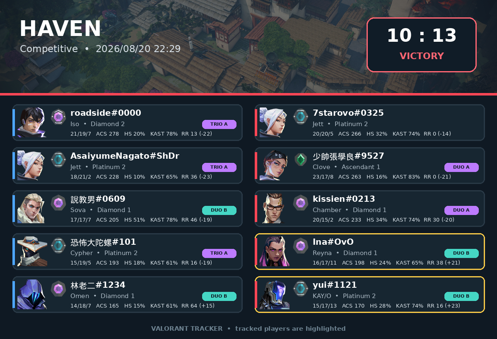
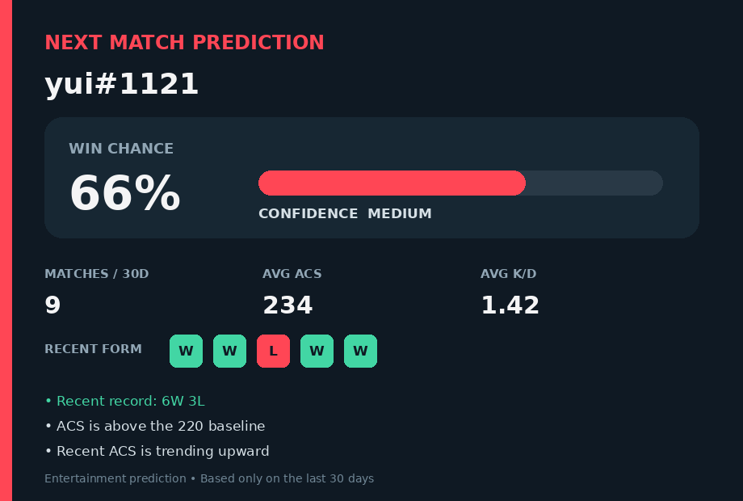
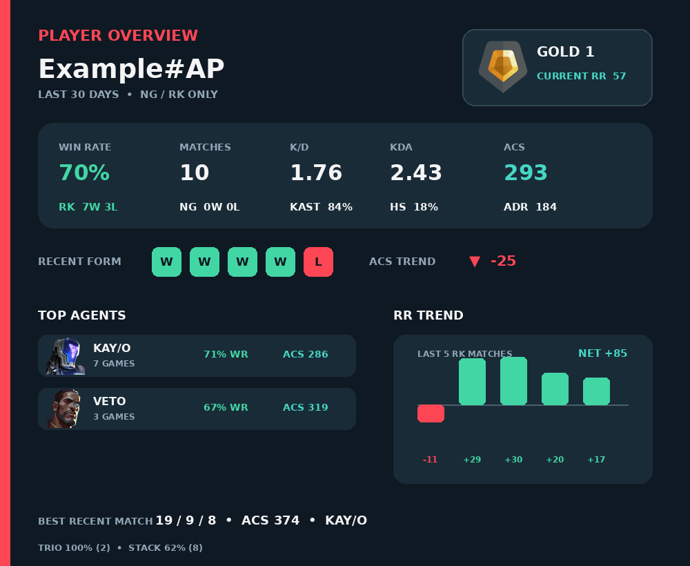

# Valorant Tracker Bot

A lightweight Discord bot that tracks registered Valorant accounts and posts
a graphical scoreboard when a new match is completed. It is designed to run as
a single process on a Raspberry Pi and uses SQLite for local persistence.

Match and account data come from the
[HenrikDev unofficial Valorant API](https://github.com/Henrik-3/unofficial-valorant-api).

## Features

- Track multiple Valorant accounts across multiple Discord servers.
- Configure one notification channel independently for each Discord server.
- Store subscriptions and match checkpoints in SQLite.
- Avoid historical notifications by using the latest match as the initial
  checkpoint when an account is registered.
- Update a checkpoint only after its Discord notification is delivered.
- Prevent duplicate tracking of the same Valorant account in one server.
- Import the legacy JSON database once and retain a timestamped backup.
- Render a graphical scoreboard with agent and rank icons, match result, map,
  queue, player statistics, HS%, ACS, KAST, and RR changes.
- Highlight registered players and label premade DUO, TRIO, and stack groups
  without exposing HenrikDev party IDs.
- Generate an explainable pre-match prediction card from a registered player's
  recent Competitive and Unrated matches.
- Render a 30-day player overview with rank and agent icons, core performance
  metrics, recent form, party results, and an RR trend chart.
- Fall back to the text embed if the graphical scoreboard cannot be rendered.
- Emit operational information and errors through Python logging, suitable for
  systemd journal monitoring on a Raspberry Pi.

## Requirements

- Python 3.11 or newer
- A Discord application and bot token
- A HenrikDev API key
- A local filesystem for the SQLite database

The live SQLite files should remain on the Raspberry Pi's local storage rather
than a network filesystem.

## Installation

Clone the repository and create a virtual environment:

```bash
git clone https://github.com/Ian-I-Chien/Valorant-Tracker.git
cd Valorant-Tracker
python3 -m venv .venv
source .venv/bin/activate
python -m pip install --upgrade pip
python -m pip install -r requirements.txt
```

Create `.env` in the repository root:

```dotenv
BOT_TOKEN=your_discord_bot_token
API_KEY=your_henrikdev_api_key
LOG_LEVEL=INFO
API_REQUESTS_PER_MINUTE=60
API_CACHE_MAX_ENTRIES=256
```

Do not commit `.env`. Discord server notification channels are configured with
commands and stored in SQLite; they do not belong in environment variables.

`API_REQUESTS_PER_MINUTE` defaults to 60 to retain headroom below a 90-request
HenrikDev key. `API_CACHE_MAX_ENTRIES` bounds the in-memory response cache for
Raspberry Pi deployments.

Start the bot:

```bash
python3 main.py
```

## Discord Setup

When inviting the bot, enable the `bot` and `applications.commands` scopes. In
the notification channel, the bot needs these permissions:

- View Channel
- Send Messages
- Embed Links
- Attach Files

After the bot joins a new Discord server, an administrator must configure the
notification channel before anyone can register an account:

```text
/set_channel channel:#valorant-results
```

This setting is isolated by Discord server. Changing it redirects all existing
subscriptions in that server immediately and does not require a bot restart.

## Commands

| Command | Who can use it | Description |
| --- | --- | --- |
| `/set_channel channel:#channel` | Server manager | Set the server's match notification channel. |
| `/show_config` | Everyone | Show the notification channel for the current server. |
| `/reg_val valorant_account:name#tag` | Everyone | Register and begin tracking a Valorant account. |
| `/del_val valorant_account:name#tag` | Account owner | Stop tracking one of the caller's accounts in this server. |
| `/predict username:name` | Everyone | Generate an entertainment-only pre-match prediction for a registered player. |
| `/info username:name` | Everyone | Show a graphical 30-day overview for a registered player. |

If `/reg_val` is used before `/set_channel`, registration is rejected with an
instruction to contact a server administrator.

`/predict` accepts either an unambiguous registered game name or a complete
`name#tag`. It only considers Competitive (RK) and Unrated (NG) matches from the
previous 30 days; Swiftplay, Deathmatch, Team Deathmatch, Spike Rush, and other
modes are excluded. If the player has no eligible match in that period, the bot
reports that there is not enough recent data instead of producing a prediction.

`/info` uses the same registered-player lookup and 30-day RK/NG filter. Its
dashboard includes win rate, match count, K/D, KDA, ACS, KAST, HS%, ADR, recent
form, top agents, party-size performance, current rank/RR, and recent RR
changes. If card rendering fails, the command returns a compact text summary.

## Persistence

Runtime data is stored in:

```text
database/valorant_tracker.db
```

SQLite WAL and shared-memory files may appear beside it while the bot runs. All
of these files are ignored by Git.

HenrikDev match lists, rank data, and MMR history use short in-memory TTLs.
Concurrent requests for the same resource share one upstream request, and a
recent stale response is used when HenrikDev is temporarily unavailable. The
poller uses a 60-second match-list TTL; interactive statistics use five minutes.

At startup, an existing `database/valorant_data.json` is imported once. The
source is retained, a timestamped backup is created, and the import is recorded
so restarting the bot does not duplicate subscriptions. Existing channel IDs
are also used to initialize the per-server notification settings.

See [the database design](designs/database.md) for the schema, transaction
boundaries, migration behavior, and Raspberry Pi considerations.

## Match Notification

The bot renders a scoreboard PNG and uploads it to Discord. Valorant map,
agent, and rank assets are downloaded on first use and cached under
`data/assets/`; the cache is ignored by Git. If an individual asset cannot be
loaded, the card is still rendered without that icon. If rendering the card
fails, the bot sends the original text embed instead.

The notification includes:

| Field | Description |
| --- | --- |
| Match date | Completion date and time |
| Map and queue | Map and game mode |
| Result | Win/loss and score |
| Player | Riot ID and agent |
| K/D/A | Kills, deaths, and assists |
| HS% | Headshot percentage |
| ACS | Average Combat Score |
| KAST | Percentage of rounds with a kill, assist, survival, or trade |
| Rank | Competitive rank when available |
| Party | Team-local DUO, TRIO, or stack label for shared party IDs |



## Pre-Match Prediction

The prediction card is an explainable entertainment baseline, not an LLM and
not a guaranteed outcome. It uses eligible recent win rate, ACS, K/D, and ACS
trend, then bounds the displayed probability between 25% and 75%. The card also
shows the sample size, confidence level, recent form, and the strongest reasons
behind the estimate. If image rendering fails, the command returns the same
result as text.

HenrikDev currently returns at most ten recent matches to this workflow, so the
30-day filter can only evaluate the eligible matches present in that response.



## Player Overview

The `/info` dashboard combines recent match data with rank history. Agent and
rank artwork are downloaded through the shared asset cache; missing remote
artwork does not prevent the rest of the card from rendering. Only Competitive
and Unrated matches completed in the previous 30 days contribute to the
performance metrics.



## Development

Install the requirements, then run:

```bash
python -m pytest -q
python -m black --check .
```

Developers with shell access can build the latest graphical match card without
sending it or changing the polling checkpoint:

```bash
python -m tools.match_output --account "Name#Tag"
```

To manually deliver a known match to the channel configured for a Discord
server, add the explicit `--send` flag:

```bash
python -m tools.match_output \
  --account "Name#Tag" \
  --match-id "MATCH_ID" \
  --server-id "DISCORD_SERVER_ID" \
  --send
```

Manual outputs are marked as developer tests and never advance a subscription's
`last_polled_match_id`.

To render a real match locally for visual review without sending it:

```bash
python -m tools.render_match_card \
  --account "Name#Tag" \
  --match-id "MATCH_ID" \
  --output match-scoreboard.png
```

The main modules are:

```text
bot.py                       Discord client, slash commands, delivery loop
commands.py                  Registration, deletion, and polling workflows
database/storage_sqlite.py   SQLite schema, repositories, and JSON migration
valorant/api.py              HenrikDev HTTP client and rate limiter
valorant/player.py           Account and rank lookups
valorant/match.py            Match lookup, statistics, and embed formatting
valorant/match_card.py       Cached assets and graphical scoreboard rendering
valorant/prediction.py       Prediction features, baseline, and card rendering
valorant/player_info.py      Player overview aggregation and card rendering
designs/database.md          Persistence design and operational notes
```

Pull requests run Black and pytest through `.github/workflows/ci.yaml`.

For a systemd deployment, inspect live bot logs with:

```bash
journalctl -u valorant-tracker.service -f
```

## Contact

Email: err@csie.io
